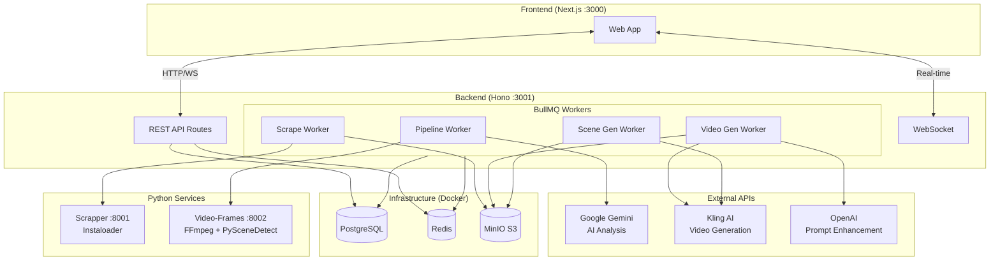
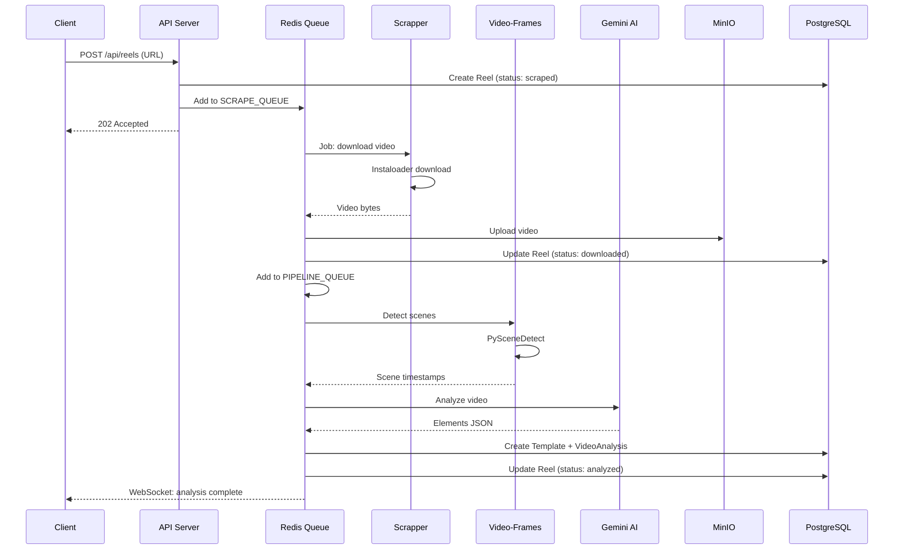
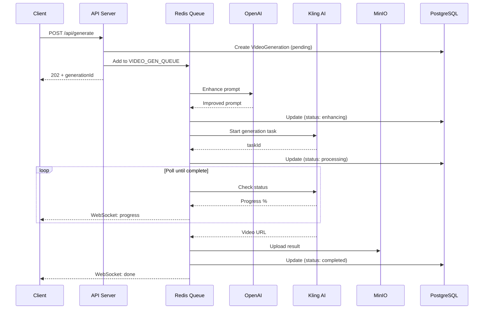
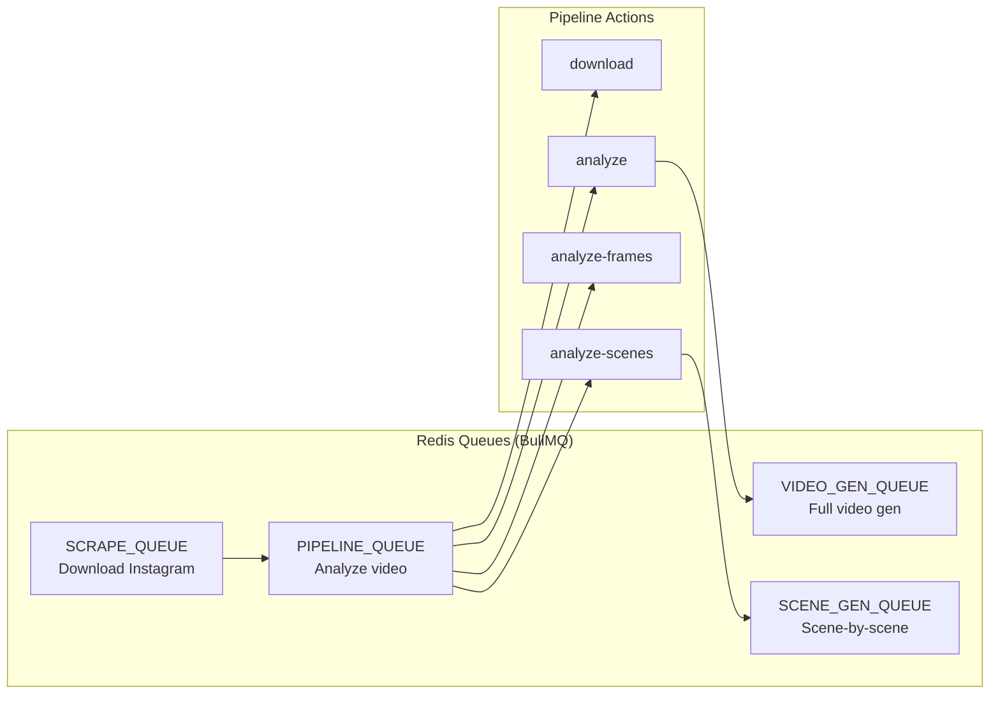
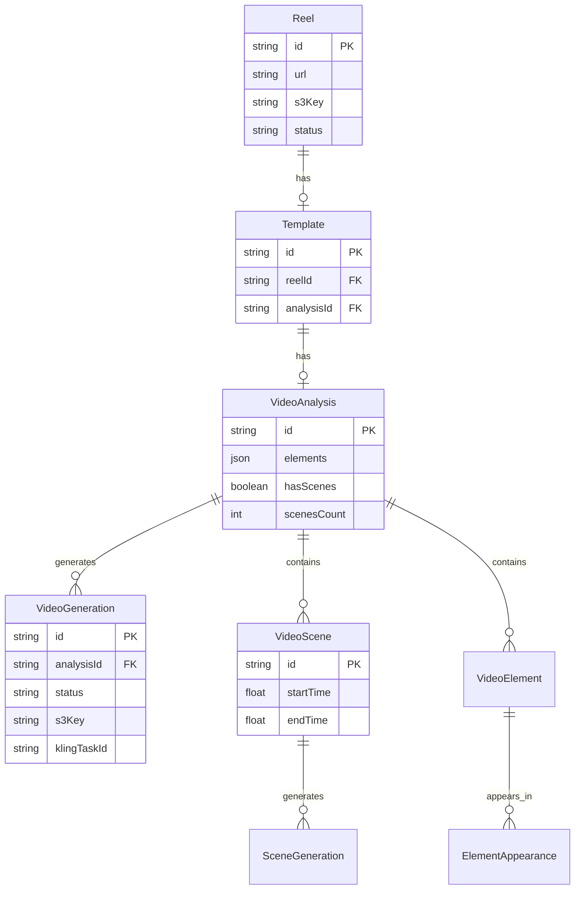

# Архитектура Trender

## Общая схема системы



## Потоки данных

### 1. Скачивание и анализ рила



### 2. Генерация видео



## Система очередей



## Модель данных



## Компоненты и порты

| Сервис | Порт | Технология | Назначение |
|--------|------|------------|------------|
| web | 3000 | Next.js 16 | Frontend UI |
| server | 3001 | Hono | REST API + Workers |
| scrapper | 8001 | FastAPI | Instagram download |
| video-frames | 8002 | FastAPI | Video processing |
| PostgreSQL | 5432 | - | Database |
| Redis | 6379 | - | Queue broker |
| MinIO | 9000/9001 | - | S3 storage |

## Статусы

### Reel
```
scraped → downloading → downloaded → analyzing → analyzed
                                  ↘ failed
```

### VideoGeneration
```
pending → enhancing → processing → downloading → uploading → completed
                                            ↘ failed
```
